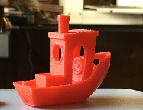
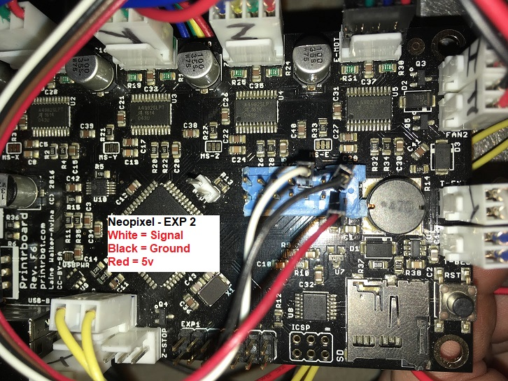
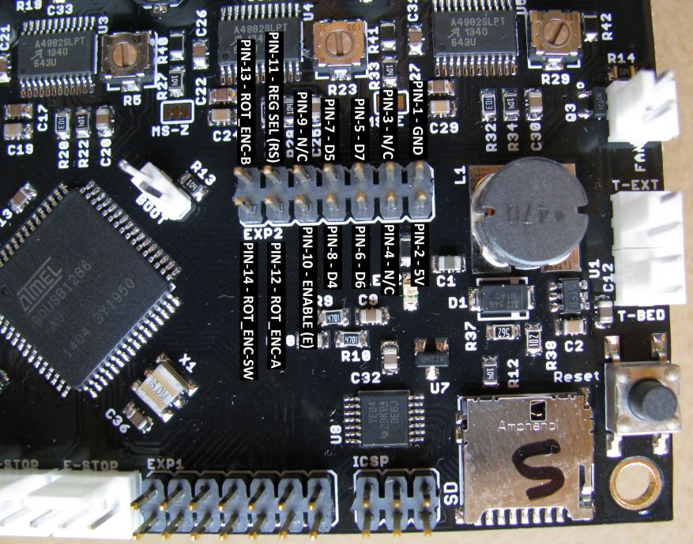

## Marlin 1.1.9
Printrboard and Modern Marlin

### Semi-Tested Release For Heated and Non-Heated Bed Models
#### Highlights

* This firmware upgrade increases print quality to a level comparable with Prusa Mk3 and Ultimaker 3 all thanks to Linear Advance v1.5 available starting with Marlin 1.1.9
* Babystepping allows live Z-offset during the start of the print
* Size optimized for 128k storage of AT90USB1286 processor
* 3 Point Leveling seems to work better for smaller beds
* Bilinear Bed Leveling which is useful for larger uneven beds

##### Change Log
    v0.6 Smalls with Heated bed 200x150x150 no lcd
    v0.5 bugs have been worked out for Play RevF, RevD and older
    v0.4 LCD and SD card support works correctly, fixed other bugs
    v0.3 Software Fan PWM disabled - caused major decrease in print quality
    v0.2 Software FAN PWM enabled to silence squeaky fans

[Marlin 1.1.9 first time bed leveling guide - after flashing](http://marlinfw.org/docs/features/auto_bed_leveling.html#first-time-bed-leveling)

##### Printrbot Play 0.2mm layer height Cura 3.5.1

    
##### This isn't your grandma's 3D printer, please make sure your inductive probe is adjusted properly
* This firmware should be universal for any printrbot, just choose heated bed firmware if you have that option.
* You will need to update the steps/mm for your machine 
[Settings for your Printer Smalls, Simple, Play Plus](https://docs.google.com/spreadsheets/d/1FntcZTm4M7FzUf9ej9DEmRYf1LaH76J8TU3VzK3Ox8g/pubhtml)
* Depending on the model of your printer you will need to adjust the Stepper current

##### Set Stepper Current
    M909
    READ: echo:Stepper current values in % (Amps):
    Stepper current values in % (Amps):
    READ: echo: X:60.00 (16581.82) Y:65.00 (36581.82) Z:60.00 (16581.82) E:65.00 (36581.82)
    X:60.00 (16581.82) Y:65.00 (36581.82) Z:60.00 (16581.82) E:65.00 (36581.82)

   Example: M907 X60 sets the X-axis motor current to 60% of max possible

    M909 Read Motor current Values
    M907 Set Current Value
    M910 Store Stepper Current Values

	
##### Linear Advance is enabled by default
    Retraction distance should be limited to 0.7mm
    Default value is K0.08 Be sure to calibrate your extruder before a
    This can be adjusted while printing
    M900 K0.08 ;set k value
    M500 ;save
    Play with MK8 style extruder Use a K0.05
 
   * Calibrate your extruder steps/mm before K-factor
    [Extruder Calibration](http://3daddict.com/3d-printer-extruder-calibration-steps/)
    
   * Please calibrate your K-factor and share results, 
   * Each material and color has its own properties for best results calibrate for each material you use.
    Add the K value to your start gCode for each material
    [Linear Advance gcode Geneartor](http://marlinfw.org/tools/lin_advance/k-factor.html)

##### Babystepping
* M290 and LCD menu items to move the axes by tiny increments without changing the current position values. This feature is used primarily to adjust the Z axis in the first layer of a print in real-time.
    * Replaces the need to set the Z offset using M212

##### Z-Offset Adjustment while printing

    Enter the increment you wish to move, send the command repeatedly
    M290 Z0.01 ;moves away from build plate
    M290 Z-0.01 ;moves towards the build plate

##### Z-Offset (the old way M212)
     M815 Z-1.95 ;this is the default value
     M500 ;save
    
##### LCD & SD Card
    LCD Support for Reprap_Discount_LCD, Ultipanel and Ultra_lcd
    SD Card reader integrated in LCD controller should work

##### Start gCode

	M82 ;absolute extrusion mode
	G21 ;metric values
	G90 ;absolute positioning
	M82 ;set extruder to absolute mode
	G28 ;move X/Y to min endstops
	G29 ;run auto bed leveling
	G92 E0 ;zero the extruded length
	G1 X0 Y0 Z.2 F7000 ;move to front corner and lower 
	G1 X35 Z.2 E35 F800 ;purge 35mm of filament
	G92 E0 ;zero the extruded length again
	G1 F9000
	;Put printing message on LCD screen
	M117 Printing...

##### Useful gCode
    M420 S1 ;loads previous bed leveling matrix
    M900 K0 ;disables Linear Advance
    M900 K0.5 ;Set linear advance K-value
    M290 Z0.02 ;babystep move up 0.02mm on the Z axis 
    
    M115 Feature support list
    M43 Debug Pins
    
   [Pin Assignments](https://labitat.dk/wiki/Panelolu_and_Printrboard_the_easy_way)

   [Expansion Header pinout diagrams](http://blog.think3dprint3d.com/2012/07/panelolu-with-printrboard.html)
  
  Neopixel Pins

EXP2 Pinout

   Using Printrboard without an LCD - all commands available 
   [LCD Menu gcode equivalent](http://marlinfw.org/docs/features/lcd_menu.html)
   
   ##### Build Using PlatformIO or Marlin-Config GUI editor
   I find Marlin GUI editor can be very laggy so instead I prefer to access it through Chrome
   
    http://localhost:3000
   
   [Marlin-config GUI](https://github.com/akaJes/marlin-config)
   The printrboard only has 128kb of program memory this build of marlin 1.1.9 as configured currently occupies 99.1%
   
   ##### Flash using ATMEL FLIP
   Before Flashing check your eprom and save your steps/mm and machine size 
   After Flashing Make sure to set EPROM to defaults using M502 then M500 to save
   [ATMEL FLIP Download](https://www.microchip.com/developmenttools/ProductDetails/FLIP)
   
   ##### Guide
   [Firmware Loading Guide](https://reprap.org/wiki/Printrboard#Loading_Firmware_.28Windows.29)
   
   ##### Programming firmware without a bootloader
Caution! Don't even mess with this if you don't know what you're doing!
DFU bootloader uses 6k of program memory, inorder to get more features in limited space I choose to program firmware using a USBtinyISP
[More information](https://reprap.org/wiki/Printrboard#Installing_A_Bootloader)
     	
	avrdude -c usbtiny -p at90usb1286 -U flash:w:FirmwareHexFileNameHere.hex:i

