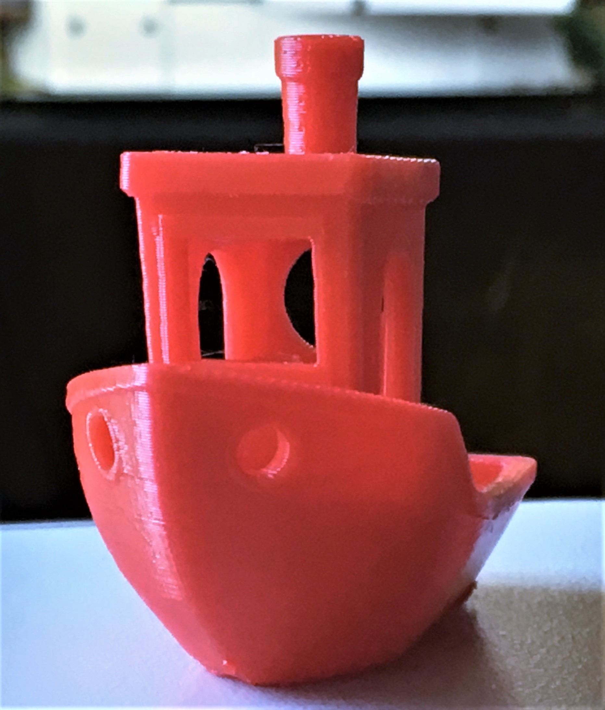

## Marlin 1.1.9
Printrboard and Modern Marlin

### This release is configured for a Printrbot Play with stepper drivers inverted, more releases will come in the following days.
#### Highlights
    
   This firmware upgrade will increase print quality to a level comparible with Prusa Mk3 or Ultimaker 3 
   all thanks to Linear Advance Version 1.5 which became avalible with marlin 1.1.9
* Babystepping allows live z offset during the start of the print
* 9 Point Auto Bilinear Mesh Bedleving
* Filament Changing routine now accessable from LCD
* Custom scrips from LCD for various tasks such as Home/Bedleveing/Preheat

#### Printrbot Play 0.2mm layer height Cura 3.5.1

![Benchy Play (benchyplayside.JPG)
    
### This isn't your grandmas 3D printer, please make sure your inductive probe is adjusted properly

    Cold End Fan not tested E0_Auto_Fan mapped to Pin 22 - will get to this asap
	Machine Definition can be updated using gCode
    	Current Steps M92 X80 Y80 Z2020 E94.5
	
### Linear Advance is enabled by default
    Retraction distance should be limited to 0.7mm
    Default vaule is K0.08 Be sure to calibrate your extruder before a
    This can be adjusted while printing
    M900 K0.08 ;set k value
    M500 ;save
    Play with MK8 style extruder Use a K0.05
 
    Calibrate your extruder steps/mm before K-factor
    http://3daddict.com/3d-printer-extruder-calibration-steps/
    
    Please calibrate your K-factor and share results, 
    Each material and color has it's own properties for best results caibrate for each material you use.
    Add the K value to your start gCode for each material
    http://marlinfw.org/tools/lin_advance/k-factor.html

### Babystepping
    M290 and LCD menu items to move the axes by tiny increments without changing the current position values. 
    This feature is used primarily to adjust the Z axis in the first layer of a print in real-time. Warning: Does not respect endstops!
    This replaces the need to set the Z offset using M212
    
#### babystepping can be adjusted while printing over usb - no LCD required
Joging the z axis down or up in incriments of 0.1mm while printing adjusts the nozzle offset
This can be done using Cura, Simplify 3D, Pronterface, etc 
Make sure to save the offset by sending the M500 command while printing

Zoffset can also be set using M815 but is not completely nessary
    M815 Z-1.95 ;this is the default value
    Use M500 to save Bed Probing

### LCD semi-tested 
    Custom User Menu Scripts
    Enabled LCD Support for Ultipanel and Ultra_lcd
    SD Card Support on the LCD is dissabled as of right now marlin has exactly engouh memory to fit on the AT90 128

### Start gCode

M82 ;absolute extrusion mode
G21 ;metric values
G90 ;absolute positioning
M82 ;set extruder to absolute mode
G28 ;move X/Y to min endstops
G29 ;run auto bed leveling
G1 Z.2 X50 F9000 ;move the platform down 15mm
G92 E0 ;zero the extruded length
G1 X0 E50 F800 E50 ;extrude 10mm of feed stock
G1 Y95 Z0 ; wipe nozzle
G92 E0 ;zero the extruded length again
G1 F9000
;Put printing message on LCD screen
M117 Printing...

### Usefull gCode
    M420 S1 ;loads previous bed leving matrix
    M900 K0 ;dissables Linear Advance
    M900 K0.5 ;Set linear advance K-value
    
    
    M115 Feature support list
    M43 Debug Pins
    Pin Assignments
    https://labitat.dk/wiki/Panelolu_and_Printrboard_the_easy_way
    
    #### Using Printrboard without an LCD - all commands avalible 
    http://marlinfw.org/docs/features/lcd_menu.html
   
   ## Build Using PlatformIO or Marlin-Config GUI editor
   I find Marlin GUI editor can be very laggy so instead I perfer to access it through Chrome http://localhost:3000https://github.com/akaJes/marlin-config
   The printrboard only has 128kb of program memory this build of marlin 1.1.9 as configured currently occupies 99.1%
   
   ## Flash using ATMEL FLIP
   Before Flashing check your eprom and save your steps/mm and machine size 
   After Flashing Make sure to set EPROM to defaults using M502 then M500 to save
   https://www.microchip.com/developmenttools/ProductDetails/FLIP
   
   #### Guide
   https://reprap.org/wiki/Printrboard#Loading_Firmware_.28Windows.29
